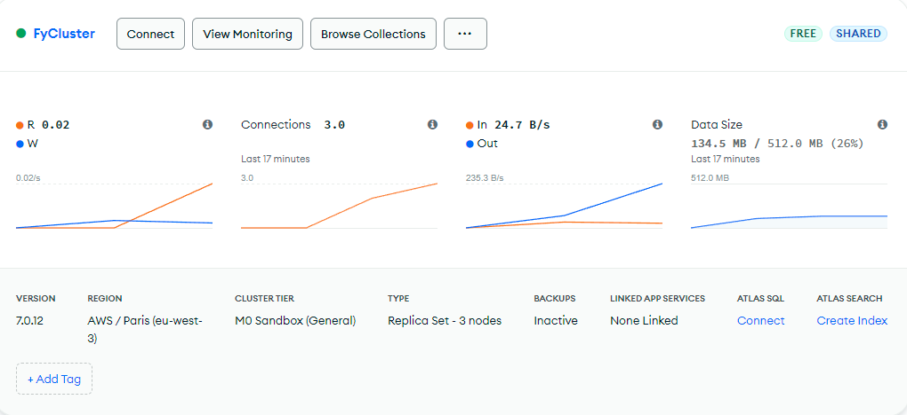

# Nombre del Proyecto

Breve descripción de tu proyecto. Explique qué hace, su propósito y a quién está dirigido.

## Tabla de Contenidos

- [Características](#características)
- [Tecnologías Utilizadas](#tecnologías-utilizadas)

## Características

- Lista de características principales.
- Integración con MongoDB.
- Interfaz de usuario responsiva.

## Tecnologías Utilizadas

- Node.js
- Express.js
- MongoDB (Mongoose)
- Otras tecnologías relevantes (React, Vue, etc.)

Screenshot del cluster:

